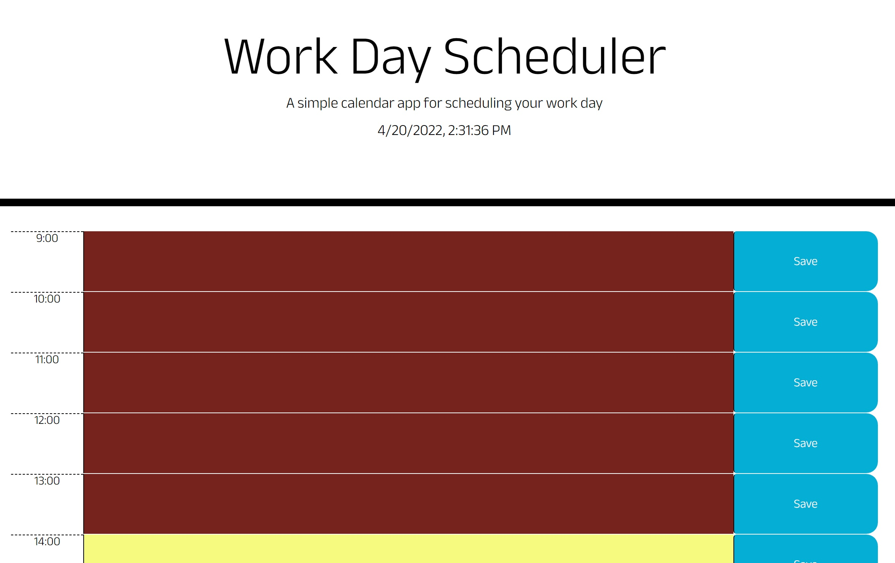

# Day-Planner

This application is a day planner that allows the user to create and log a to-do list throughout their day starting from 9 AM to 5 PM in military time. Upon clicking the 'save' button, the user's input in the corresponding time is logged and stored in the local storage of their browser. Each time block is color coded for the user's benefit:

```
1. Green time block = an hour that is in the future
2. Yellow time block = the current hour
3. Red time block = an hour that is in the past
```


At any given time, the user can return back to the application and their previous saved input will automatically load once the application is started.

At the top of the page, a live clock, along with the current date is displayed for the user to utilize. 

An image of the Day Planner:



The Day Planner can be accessed here: 

[https://axe714.github.io/Day-Planner/]